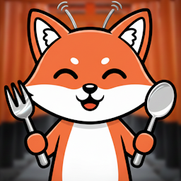
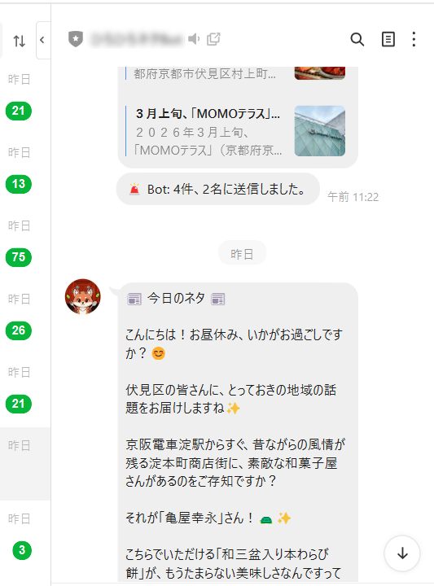

# Hiro2 Feed picker

An AI-powered RSS curation tool for Google Apps Script and Google Sheets. Filters articles by keywords and delivers summaries to LINE.

## 概要 (日本語)

AI(Google Gemini)を活用したRSSキュレーションツールです。Google Apps ScriptとGoogleスプレッドシート上で動作します。

スプレッドシートにRSSフィードなど事前に人力で登録します。

その上で、本スクリプトはRSSフィードからキーワードに合致する記事を抽出し、AI（Gemini）による要約をLINEに通知します。

## 稼働環境

* （事前に必要なシートを用意された）スプレッドシートにひもづくGAS (=Google Apps Script)
* GEMINI API KEY
* LINE Messagingに関する、ACCESS TOKEN（チャネルアクセストークン）・CHANNEL SECRET（チャネルシークレットID）・OWNER USER ID（あなたのユーザーID）

## 事前にスプレッドシートで用意すべきシート

このスクリプトを実行するGoogleスプレッドシートには、以下のシートが必要です。

設定として使用します。

### 1. `RSS`シート

| A | B |
| :--- | :--- |
| サイト名など(任意) | RSSフィードのURL |

B列に購読したいRSSフィードのURLを入力してください。

#### `RSS`シートの例

| A | B |
| :--- | :--- |
| 号外NET 伏見区 | <https://fushimi.goguynet.jp/feed/> |
| ALCO 宇治・城陽 山城地域の情報サイト | <https://alco-uj.com/feed/> |

### 2. `keywords`シート

| A |
| :--- |
| キーワード1 |
| キーワード2 |

A列にフィルタリングしたいキーワードを入力してください。

記事のタイトルまたは概要にこれらのキーワードが含まれるものが抽出対象となります。

#### `keywords`シートの例

| A |
| :--- |
| ケーキ |
| フルーツ |
| ベーグル |

### 3. `userId`シート

| A |
| :--- |
| Uxxxxxxxxxxxxxx... |
| Uxxxxxxxxxxxxxx... |

A列に通知を届けたいLINEユーザーのIDが自動で記載されます。

LINE Botを友だち追加すると、このシートにユーザーIDが自動で追加されます。

#### `userId`シートの例

| A |
| :--- |
| U1b1b8a7d1698d3e3d2b2ba1844130... |
| U06b532f083f798e8ceb07aa928869... |

## 導入手順

1. **LINE Botのセットアップ**:

   * [LINE公式アカウント](https://www.lycbiz.com/jp/service/line-official-account/)と[LINE Developersコンソール](https://developers.line.biz/ja/)に登録します。
   * LINE DevelopersコンソールでプロバイダーとMessaging APIチャネルを作成します。
   * Messaging APIチャネルの「Messaging API設定」タブで、**チャネルアクセストークン（長期）**: 発行して控えておきます。後のステップでGASに設定します。

1. **Google Apps Scriptプロジェクトの作成**:

   * Googleスプレッドシートから、`拡張機能` > `Apps Script` を選択し、スクリプトエディターを開きます。
   * `<> エディタ` > `main.js`と、`⚙ プロジェクトの設定` より ☑ `「appsscript.json」マニフェスト ファイルをエディタで表示する` を有効化したうえで `エディタ` > `appsscript.json`の内容をそれぞれコピー＆ペーストします。

1. **スクリプトプロパティの設定**:

   * 再度`⚙ プロジェクトの設定`を開きます。
   * `スクリプト プロパティ` セクションで、以下の4つのプロパティを追加・設定します。
     * `GEMINI_API_KEY`: ご自身のGoogle Gemini APIキー
     * `GEMINI_PROMPT`: Google Geminiにプロンプトとして依頼するBotの目的、例 `読まれる時間帯は昼休み。読者は京都市伏見区在住者。主な関心は気になる地域の話題。`
     * `LINE_ACCESS_TOKEN`: ステップ1の`LINE Developersコンソール`より`Messaging API設定`のチャネルアクセストークン
     * `LINE_OWNER_USER_ID`: Botの管理者であるご自身のLINEユーザーID、ステップ1の`LINE Developersコンソール`より`チャネル基本設定`から確認できます

1. **LINE Botの友だち追加**:

   * GASより「デプロイ」→「新しいデプロイ」より「ウェブアプリ」としてデプロイし生成されたURLをコピーします。
   * LINE公式アカウントより、今回作成したアカウント名→設定：応答設定から応答機能：Webhookを有効化するようにします。
   * LINE Developersコンソールより、当該チャネルの「Messaging API設定」より、「Webhook設定」の「Webhook設定」における「Webhook URL」を「編集」して、GASでデプロイして生成されたURLを当てはめます。また、同「検証」ボタンより設定したWebhook URLでWebhookイベントを受け取ると、「成功」と表示されることを確認します。
   * 作成したLINE Botを友だち追加すると、Webhookイベントを通じて、Googleスプレッドシートの`userId`シートにあなたのユーザーIDが自動的に登録され、通知が届くようになります。

1. **実行**:

   * `<> エディタ` > `main.js`を開きます。
   * `▷ 実行` をクリックします。成功するとLINEに登録したチャネルから通知が届きます。

1. **トリガーの設定**:

   * `⏰ トリガー`を開きます。
   * `＋ トリガーを追加` をクリックし、`main`関数を定期的に実行するよう設定します（例: 実行する関数は`main`、デプロイ時に実行は`Head`、イベントのソースは`時間主導型`、時間ベースのトリガーのタイプは`日付ベースのタイマー`、時刻は`午前11時～12時`、エラー通知設定は`毎日通知を受け取る`）。

## ライセンス

このプロジェクトは[MITライセンス](./LICENSE)の下で公開されています。

## 作者

[hiroshikuze](https://github.com/hiroshikuze/)

---

## 💖 応援募集 (Support my work)

このプロジェクトを応援していただける方は、ぜひスポンサーおよび寄付をお願いします！

If you'd like to support my projects, please consider becoming a sponsor!

